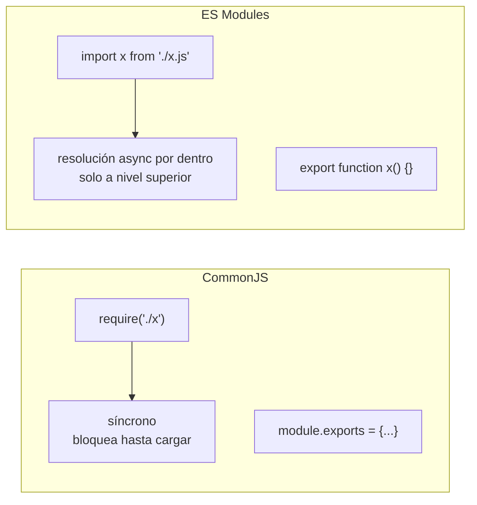
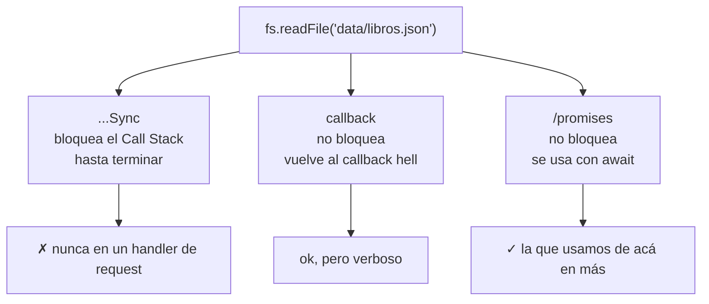

# Clase 3 — Módulos, `fs` y servidor HTTP puro

## Objetivos de la clase

- Entender los dos sistemas de módulos de Node (CommonJS y ES Modules) y cuándo se usa cada uno.
- Leer y escribir archivos con `fs`, en sus tres variantes: síncrona, con callback, y con promesas.
- Levantar un servidor HTTP sin Express, para entender a mano qué problemas resuelve Express la clase que viene.

## 1. Módulos: por qué existen

Hasta ahora todo el código vivía en pocos archivos que se importaban con `require`/`module.exports`, sin pensarlo mucho. Hoy vemos en serio **por qué** existen los módulos y **qué alternativas hay**.

Sin módulos, todo el código de un programa comparte un mismo scope global: dos archivos que declaran una variable con el mismo nombre chocan entre sí. Un módulo es simplemente un archivo con su **propio scope aislado**, que decide explícitamente qué expone hacia afuera (`export`) y qué mantiene privado.

Node soporta dos sistemas de módulos, con reglas distintas:

### CommonJS (`require` / `module.exports`)

El sistema original de Node, anterior a que JS tuviera módulos estándar. Es el que venimos usando.

```js
// libroService.js
function listarLibros() { /* ... */ }
function buscarPorId(id) { /* ... */ }

module.exports = { listarLibros, buscarPorId };
```

```js
// index.js
const { listarLibros, buscarPorId } = require("./libroService");
```

- `require` es **síncrono**: cuando se llama, Node para todo, busca el archivo, lo ejecuta entero y recién ahí sigue.
- Se puede llamar en cualquier parte del código, incluso condicionalmente (`if (algo) { require(...) }`).
- **No tiene hoisting**: `require` es una llamada de función como cualquier otra, se ejecuta en el orden exacto en que aparece en el código, de arriba hacia abajo.
- Cada archivo tiene automáticamente `__dirname`, `__filename`, `module`, `exports`.

### ES Modules (`import` / `export`)

El sistema estándar del lenguaje JavaScript (el mismo que usa el navegador). Para activarlo en Node hay que avisarle, con una de estas dos opciones:

- Agregar `"type": "module"` al `package.json` (afecta a todo el proyecto), **o**
- Nombrar el archivo con extensión `.mjs`.

```js
// libroService.js (con "type": "module" en package.json)
export function listarLibros() { /* ... */ }
export function buscarPorId(id) { /* ... */ }
```

```js
// index.js
import { listarLibros, buscarPorId } from "./libroService.js";
```

- Los `import` se resuelven de forma **asíncrona** por dentro (aunque en el código se vean arriba de todo) y **deben** ir al nivel superior del archivo — no se pueden meter dentro de un `if`.
- **Se comportan como si tuvieran hoisting**: Node procesa y enlaza todos los `import` de un archivo **antes** de ejecutar cualquier línea de código de ese módulo. Por eso se puede usar un nombre importado en una función definida arriba del `import` en el archivo — algo que con `require` rompería.
- **Exportan *live bindings*, no valores copiados**: un `import` es una referencia viva a la variable original del módulo fuente. Si ese módulo reasigna la variable exportada, quien la importó ve el valor actualizado automáticamente, sin volver a importar nada.
- En un archivo ESM las rutas de import **necesitan la extensión** (`./libroService.js`, no `./libroService`) — a diferencia de CommonJS.
- No existen `__dirname` ni `__filename` directamente — se reconstruyen a partir de `import.meta.url` si hacen falta.
- Import dinámico (`await import("./modulo.js")`) permite cargar un módulo de forma condicional, ya que es una promesa.
- `await` a nivel superior del archivo (**top-level await**, sin envolver en una función `async`) solo existe en ESM.

### Hoisting: `import` sí, `require` no

```js
// CommonJS — esto explota:
console.log(sumar(2, 3)); // ReferenceError: Cannot access 'sumar' before initialization
const { sumar } = require("./matematica");
```

```js
// ESM — esto funciona:
console.log(sumar(2, 3)); // funciona, aunque el import está más abajo

import { sumar } from "./matematica.js";
```

La razón es la misma que separa a los dos sistemas en todo lo demás: `require` es una llamada de función que se ejecuta en el momento en que el intérprete pasa por esa línea. `import`, en cambio, se resuelve en una fase previa (instanciación) que enlaza todos los bindings **antes** de que corra el cuerpo del módulo — igual que pasa con las funciones declaradas con `function`.

### Live bindings: ESM exporta referencias vivas, CommonJS copia valores

```js
// contador.js (ESM)
export let valor = 0;
export function incrementar() { valor++; }
```

```js
// main.js
import { valor, incrementar } from "./contador.js";
console.log(valor); // 0
incrementar();
console.log(valor); // 1 — se actualizó solo: es el mismo binding, no una copia
```

Con CommonJS no pasa esto: si `contador.js` hiciera `let valor = 0; exports.valor = valor;` y después hiciera `valor++` puertas adentro, quien hizo `require("./contador")` seguiría viendo `valor: 0` — lo que se copió a `exports.valor` fue el valor de `valor` en el momento exacto de esa asignación, no una referencia que seguiera actualizándose.

### ¿Cuál usamos?

Hoy, en el proyecto integrador, seguimos con CommonJS (`require`/`module.exports`) — es el que venimos usando desde la clase 1 y el default de Node sin configuración extra. Pero **ES Modules es el estándar del lenguaje y hacia dónde vamos**: más adelante en la cursada el proyecto integrador va a migrar a `import`/`export`. Por eso hoy conviene entender bien los dos, no solo para saber leer código ajeno (paquetes de npm, documentación, proyectos de otros), sino porque en algún momento van a dar el salto ustedes mismos. No se pueden mezclar directamente en el mismo archivo (`require` de un archivo ESM, o `import` de uno CommonJS, requieren trucos que están fuera del alcance del curso).



*(si tu editor no renderiza Mermaid, instalá la extensión "Markdown Preview Mermaid Support" en VSCode, o mirá el archivo directamente en GitHub)*

## 2. El módulo `fs`

`fs` (file system) es el módulo nativo de Node para leer y escribir archivos. Tiene **tres variantes** para cada operación — y elegir la correcta importa, sobre todo después de lo que vimos de Event Loop en la clase 2.

### Síncrona (`fs.readFileSync` / `fs.writeFileSync`)

Bloquea el hilo principal hasta terminar. Mientras lee o escribe, **Node no puede hacer nada más** — ni atender otra request, ni resolver una promesa pendiente.

```js
const fs = require("fs");

const contenido = fs.readFileSync("data/libros.json", "utf-8");
const libros = JSON.parse(contenido);

fs.writeFileSync("data/libros.json", JSON.stringify(libros, null, 2));
```

Cuándo está bien usarla: scripts chicos de un solo uso, código de arranque que corre una sola vez antes de levantar el servidor. **Nunca** dentro del manejo de una request en un servidor — bloquearía a todos los demás clientes mientras dura la lectura/escritura.

### Con callback (`fs.readFile` / `fs.writeFile`)

La API asíncrona clásica de Node, previa a las promesas. No bloquea, pero vuelve al patrón de callbacks que vimos en la clase 2.

```js
fs.readFile("data/libros.json", "utf-8", (error, contenido) => {
  if (error) {
    console.error("Error leyendo:", error);
    return;
  }
  const libros = JSON.parse(contenido);
  console.log(libros);
});
```

### De dónde sale `new Promise` — envolviendo un callback a mano

En la clase 2 usamos promesas que ya venían hechas (`fetch` devuelve una). Nunca vimos **de dónde salen** — cómo se fabrica una promesa desde cero. La respuesta: con el constructor `new Promise`, que se usa exactamente para esto — convertir una API vieja basada en callbacks (como `fs.readFile` de arriba) en algo que se pueda usar con `.then`/`await`.

```js
const fs = require("fs");

function leerArchivo(ruta) {
  return new Promise((resolve, reject) => {
    fs.readFile(ruta, "utf-8", (error, contenido) => {
      if (error) {
        reject(error);      // la promesa termina en estado "rejected"
        return;
      }
      resolve(contenido);   // la promesa termina en estado "fulfilled"
    });
  });
}

leerArchivo("data/libros.json")
  .then((contenido) => console.log(JSON.parse(contenido)))
  .catch((error) => console.error("Error:", error));
```

Cómo se lee esto:

- `new Promise(ejecutor)` recibe una función (el **ejecutor**), que Node llama **de inmediato**, de forma síncrona, pasándole dos funciones como parámetros: `resolve` y `reject`.
- Adentro del ejecutor va el código asíncrono de siempre (acá, el `fs.readFile` con callback). Cuando ese código termina bien, se llama a `resolve(valor)` — eso es lo que va a recibir quien haga `.then(valor => ...)` o `await`. Si termina mal, se llama a `reject(error)` — eso es lo que cae en `.catch` o en el `catch` de un `try/catch`.
- Una promesa solo puede resolverse o rechazarse **una vez**: llamar a `resolve`/`reject` de nuevo después no tiene efecto.
- La promesa devuelta por `new Promise(...)` se puede consumir con `.then/.catch` **o** con `await` dentro de una función `async` — son la misma promesa, dos formas de leerla (como vimos en la clase 2).

**Por qué importa saber esto:** es exactamente lo que hacen por dentro las librerías que "convierten" APIs de callback a promesas — incluido el propio Node con el módulo que viene a continuación. No van a necesitar escribir `new Promise` seguido (Node y la mayoría de las librerías modernas ya devuelven promesas hechas), pero cuando se topen con una librería vieja que solo ofrece callbacks, este es el patrón para adaptarla.

### Con promesas (`fs/promises`) — la que vamos a usar

Node expone una versión del mismo módulo que devuelve promesas, pensada para combinar con `async/await` — construida internamente con el mismo patrón `new Promise` de arriba. Es la forma recomendada para escribir código nuevo.

```js
const fs = require("fs/promises");

async function leerLibros() {
  const contenido = await fs.readFile("data/libros.json", "utf-8");
  return JSON.parse(contenido);
}

async function guardarLibros(libros) {
  await fs.writeFile("data/libros.json", JSON.stringify(libros, null, 2));
}
```



*(si tu editor no renderiza Mermaid, instalá la extensión "Markdown Preview Mermaid Support" en VSCode, o mirá el archivo directamente en GitHub)*

## 3. Persistir datos en JSON

Hasta la clase 1, `data/libros.js` era un array **hardcodeado en memoria** — al reiniciar el proceso, cualquier cambio se perdía. Hoy damos el primer paso hacia persistencia real: guardar esos mismos datos en un **archivo `.json`** en disco, y leer/escribir ahí.

El patrón es siempre el mismo par de funciones:

```js
// JSON.stringify(objeto, null, 2) → formatea con indentación de 2 espacios, legible
await fs.writeFile("data/libros.json", JSON.stringify(libros, null, 2));

// JSON.parse(texto) → convierte el string leído de vuelta a array/objeto de JS
const libros = JSON.parse(await fs.readFile("data/libros.json", "utf-8"));
```

Esto **no es todavía** el DAO/Repository que van a ver en la clase 8 — es la semilla. Hoy el archivo `.json` reemplaza al array en memoria como fuente de la verdad, pero las funciones siguen viviendo sueltas en `libroService.js`, sin capas ni abstracción todavía. La idea de "guardar en un archivo en vez de en memoria" es exactamente la misma que después va a aparecer, con nombre propio, como uno de los adaptadores de persistencia intercambiables.

## 4. Servidor HTTP puro (sin Express)

Node trae un módulo `http` que permite levantar un servidor web **sin ninguna dependencia externa**. Vamos a usarlo hoy, a mano, para entender qué hace un framework como Express por debajo — y por qué, a partir de la próxima clase, preferimos no reinventarlo.

```js
const http = require("http");

const servidor = http.createServer((req, res) => {
  console.log(req.method, req.url); // ej: GET /libros

  if (req.method === "GET" && req.url === "/libros") {
    res.writeHead(200, { "Content-Type": "application/json" });
    res.end(JSON.stringify({ mensaje: "acá van los libros" }));
    return;
  }

  res.writeHead(404, { "Content-Type": "application/json" });
  res.end(JSON.stringify({ error: "Ruta no encontrada" }));
});

servidor.listen(3000, () => {
  console.log("Servidor escuchando en http://localhost:3000");
});
```

Piezas clave:

- `http.createServer(callback)` recibe una función que se ejecuta **una vez por cada request** que llega. Ese callback recibe dos objetos: `req` (la request entrante: método, url, headers, body) y `res` (la respuesta que armamos nosotros a mano).
- **No hay routing automático**: comparar `req.method` y `req.url` a mano, con `if`/`else`, es responsabilidad nuestra.
- **No hay parseo de body automático**: si un `POST` trae JSON en el body, hay que escuchar el evento `data` del stream de `req`, acumularlo, y parsearlo a mano (lo vemos brevemente en la práctica, y en detalle cuando Express lo resuelva por nosotros).
- `res.writeHead(status, headers)` fija el código de estado HTTP y los headers **antes** de mandar el cuerpo.
- `res.end(cuerpo)` envía la respuesta y cierra la conexión. Sin esto, el cliente queda esperando para siempre.

Esto es exactamente lo que Express (clase 4) resuelve por nosotros: parseo de body, routing declarativo (`app.get("/libros", ...)` en vez de comparar `req.url` a mano), middlewares, manejo de errores centralizado. Hoy lo hacemos a mano una sola vez para que, cuando en la próxima clase aparezca `app.get(...)`, entiendan qué esconde esa línea por debajo.

## Cierre

Con esto ya tenemos las tres piezas sueltas que Express va a empaquetar la próxima clase: un módulo (`libroService.js`) que ahora persiste en archivo en vez de en memoria, y un servidor HTTP que sabe responder según método y ruta. En la clase 4 estas piezas se combinan en un CRUD in-memory con Express — a propósito, todavía sin separar en capas.